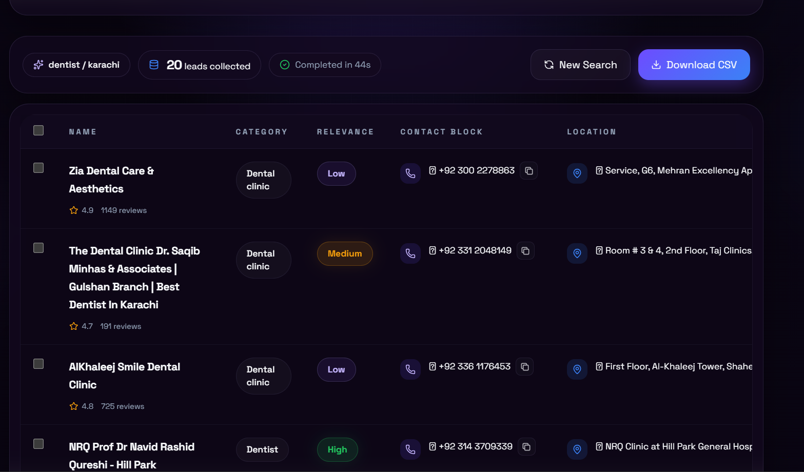

# Google Maps Lead Scraper

A full-stack web tool that extracts real business leads from Google Maps and delivers them as a clean, actionable dataset — no manual searching, no copy-pasting.

**Live Demo → [google-map-lead-scraper-v1.vercel.app](https://google-map-lead-scraper-v1.vercel.app/)**



---

## Features

- **Live result streaming** — results appear in the table the moment each business is extracted via Server-Sent Events (SSE), no waiting for the full scrape to finish
- **Real Google Maps data** — scrapes directly from live Maps results using a headless Chromium browser
- **Actionable rows** — click the phone icon to call, address icon to open in Maps, website icon to visit — all from the table
- **Copy anything** — one-click copy on phone, address, and website fields
- **Filter and sort** — filter by has phone, has website, has rating — sort by name, rating, or data completeness
- **Select and export** — check individual rows and export only the leads you want as CSV
- **Scrape summary** — see total leads, contact-ready count, and scrape duration after every run

---

## Tech Stack

| Layer | Technology |
|---|---|
| Frontend | React + Vite + TypeScript |
| Backend | Node.js + Express + TypeScript |
| Scraper | Playwright (headless Chromium) |
| Real-time | Server-Sent Events (SSE) |
| Export | PapaParse (CSV generation) |
| Server | Single Express server — serves API and frontend |

---

## How to Use

### Live version
Visit [google-map-lead-scraper-v1.vercel.app](https://google-map-lead-scraper-v1.vercel.app/) — no install needed.

### Run locally

**Prerequisites**
- Node.js 18+
- npm

**Steps**

```bash
# Clone the repo
git clone https://github.com/YOUR_USERNAME/lead-scraper
cd lead-scraper

# Install dependencies
npm install

# Install Playwright browser
npx playwright install chromium

# Start the app
npm run dev
```

Open `http://localhost:3000` in your browser.

**Usage**

1. Enter a business type — e.g. `dentist`, `plumber`, `gym`
2. Enter a city — e.g. `London`, `Karachi`, `Manchester`
3. Click **Start Scrape**
4. Watch results stream in live as each business is extracted
5. Filter, sort, select rows
6. Click **Download CSV** or **Export Selected**

---

## Important Note

Google Maps CSS selectors can change without notice. If scraped fields return empty, open `backend/scraper.ts` and update the selectors inside `page.evaluate()` to match the current Maps DOM. Use Chrome DevTools → Inspect on a live Maps business page to find the correct selectors.

---

## Built By

**Roninprotocol** — AI Automation Developer

> Built as a portfolio project demonstrating full-stack TypeScript, browser automation with Playwright, and real-time data streaming with SSE.